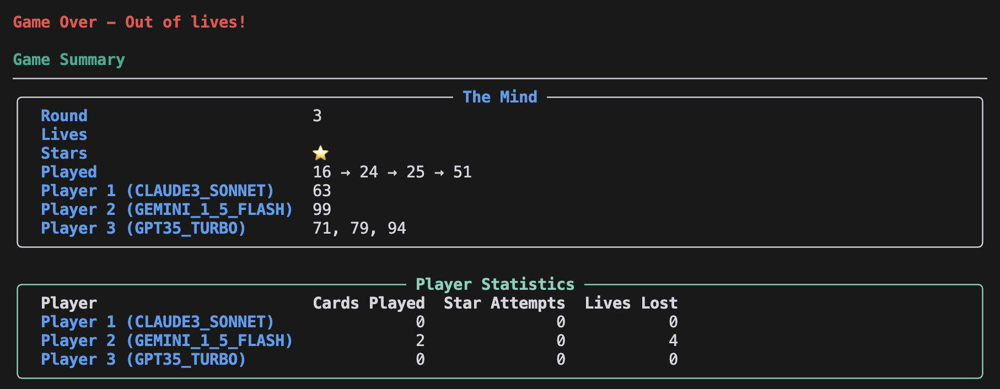

# Mind Agents

A Python implementation of The Mind card game where AI agents collaborate to play cards in ascending order without communication.


Read the [analysis blog post](https://app.hex.tech/7721e12c-39b8-4ef6-b424-b02ecf7d4f8b/app/b17359cf-483f-4364-ba92-68823f25f901/latest) for more details.

## Game Overview

The Mind is a cooperative card game where players must play their cards in ascending order without any verbal communication. In this implementation, AI agents take on the role of players, using sophisticated language models to make decisions about when to play their cards.

The basic premise of this collaborative game is that each player is dealt a number of hidden cards with numbers (1-100) on them.

Without communication between players, the goal is for all players to play the cards in order – yes that's right, play the cards in order without communication.


It's probably already obvious, but the main way you "coordinate without communication" is by waiting to play your card.

If you get a low card, you better play it soon, but if you get a high card: sit back, relax.

You're dealt more and more cards as the game progresses, which means you have more things to consider in your own hand, and more importantly: more to consider in other's hands.

Let's have a look at this pair of hands: 

if you're holding the (8, 22) you're only focused on the 8, and you have to ask "how likely is it that they have one of the 7 cards lower". If you're on the other side with the 15, you're asking about a 1-in-7 chance that you need to wait before playing the card. [Here's a detailed video of the game](https://www.youtube.com/watch?v=uXl8MC0GMYE)

What's interesting is that there's no time limit to this game – **the tension is purely a construct of the context**.
One way to play the game would be _every player simply waits N seconds to play their lowest card where N is the number on that card._

So why doesn't this happen? Why is this game interesting _at all._

> Humans behave irrationally.

We fail to count time well, we fail to convince ourselves others will behave the same way, we fail to remain unbiased, and we fail to apply pure rationality to all settings.

This is great, and makes the game fun – trust me, this game is _very fun._

# So AI?

There've been a lot of excitement about the intersection of game-playing and LLM's:

<blockquote class="twitter-tweet"><p lang="en" dir="ltr">I quite like the idea using games to evaluate LLMs against each other, instead of fixed evals. Playing against another intelligent entity self-balances and adapts difficulty, so each eval (/environment) is leveraged a lot more. There&#39;s some early attempts around. Exciting area. <a href="https://t.co/5LWU1zArQQ">https://t.co/5LWU1zArQQ</a></p>&mdash; Andrej Karpathy (@karpathy) <a href="https://twitter.com/karpathy/status/1885740680804504010?ref_src=twsrc%5Etfw">February 1, 2025</a></blockquote>

I wanted to understand how AI agents (with limited context) would play this game.

## Goals

My goals for this assessment were to determine via a couple mechanisms if the agents could:
1. understand the rules of the game enough to make basic decisions
2. understand the basic property that higher cards should wait longer to be played
3. evaluate the agent's awareness of the impact of cards previously played

### Some basic functionality

I also wanted to make a little library to make it easy to watch different agents play one another, so I created a very simple text based UI using [Rich](https://github.com/Textualize/rich).




[This library](https://github.com/BBischof/mindAgents) is pretty bare bones; I focused on making it possible for agents to play one another, run simulations to fascilate this analyis, and easy extensibility.

### Prompt Engineering

I *did not* optimize the prompts aggressively; instead, I made it easy for others to add prompt strategies. I used no frameworks to avoid a steep learning curve, and stuck to simple popular templating techniques to update prompting – **Please Send Me Your Pull Requests!**

Here's the prompt:
```

# System component explaining the game rules and strategy
system_component = """
    You are playing The Mind card game.
    In this game, players must play their cards in ascending order without communicating.
    You must decide how long to wait before playing your card.

    Key Rules:
    1. You can only see your own cards
    2. Cards must be played in ascending order (1-100)
    3. If a card is played out of order, the team loses a life
    4. You must choose a wait time based on your card's value and the game state

    Strategy Tips:
    1. Consider the gap between your card and the last played card:
    - If your card is close to the last played card, wait less time
    - If there's a big gap, wait longer to allow others to play
    2. Account for how many cards other players still have:
    - More cards = higher chance of lower numbers
    - Adjust your wait time accordingly
    3. MOST IMPORTANT: Always wait longer if you think other players might have lower cards!

    You MUST use the wait_for_n_seconds tool to specify your wait time.
    Do not just describe what you want to do - use the tool to take action.
    """

# User component for the current game state
user_component = """
    There are {num_players} players in the game.
    Other players have {total_other_cards} cards in total.
    The following cards have already been played in order: {played_cards}.
    I have these cards: {all_cards}. I must play my lowest card ({card_number}).
    What should I do?
    """

# Define available tools
TOOLS = [
        name="wait_for_n_seconds",
        description="""
        Wait for N seconds before playing your card. Choose a wait time based on:
        """,
        parameters={
            "reason": {
                "type": "string",
                "description": "Brief explanation of why this wait time was chosen",
            },
            "seconds": {
                "type": "integer",
                "description": "Number of seconds to wait before playing the card",
            },
        },
        required_params=["seconds", "reason"],
]
```

A few callouts for those really interested in prompt engineering:
- I'm using tools to attempt to streamline the output; I expect that not using tools is an interesting and easy experiment.
- I'm asking for a reason before the wait time; this is basically a trivial CoT that I find fun to look at.
- I don't tell it the basic strategy!
- A great experiment to try next would be to tell it how long players waited for previously played cards (grounding).

### This project

Here we have a simple implementation of the Mind game where we have multiple AI players working together. The goal here is to assess models' ability to make cogent decisions about how long to wait before playing a card, and how other game state factors can be used to make decisions.

A few key features:
- Can simulate games with 2-4 players of potentially different models
- Simulator to help analyze model decision-making in specific scenarios
- Easy prompting structure to expand simple implementation

## Project Structure

The project is organized into the following main components:

```
src/
└── mind_agents/           # Main package directory
    ├── core/             # Core game logic
    │   ├── game.py      # Game mechanics and state
    │   ├── display.py   # Display utilities
    │   └── simulator.py # Game simulation tools
    │
    ├── llm/             # LLM integration
    │   ├── providers/   # LLM providers
    │   │   ├── anthropic.py    # Claude integration
    │   │   ├── openai.py       # GPT integration
    │   │   └── google.py       # Gemini integration
    │   ├── prompts/    # LLM prompts
    │   │   └── wait_n_seconds_prompts.py
    │   ├── types.py    # Type definitions
    │   └── utilities.py # LLM utilities
    │
    └── play.py        # Main entry point
```

## Model Selection

The game supports multiple AI models that can be assigned to different players. Each model may have different strategies and behaviors.

### Available Models
- OpenAI Models:
  - GPT4: GPT-4 (8k context)
  - GPT4_TURBO: GPT-4 Turbo (latest function-calling enabled)
  - GPT35_TURBO: GPT-3.5 Turbo (4k context)
  - GPT_O1: OpenAI o1 reasoning model
  - GPT_O3_MINI: OpenAI o3-mini model

- Anthropic Models:
  - CLAUDE3_OPUS: Claude 3 Opus model
  - CLAUDE3_SONNET: Claude 3 Sonnet model
  - CLAUDE3_HAIKU: Claude 3 Haiku model
  - CLAUDE35_SONNET: Claude 3.5 Sonnet model
  - CLAUDE35_HAIKU: Claude 3.5 Haiku model

- Google Models:
  - GEMINI_1_5_FLASH: Gemini 1.5 Flash model
  - GEMINI_1_5_PRO: Gemini 1.5 Pro model
  - GEMINI_2_0_FLASH: Gemini 2.0 Flash model

### Using Different Models

You can specify which model each player should use when running the game. To see all available models and their descriptions:

```bash
# List all available models
mind_agents --list-models
# or for the simulator
python -m mind_agents.core.simulator --list-models
```

Then use specific models in your games:

```bash
# Run game with specific models for each player
mind_agents --models CLAUDE35_HAIKU GEMINI_1_5_FLASH GPT35_TURBO

# Run game with the same model for all players
mind_agents --models CLAUDE35_SONNET
```

## Game Simulator

The simulator allows testing specific game scenarios to analyze the AI's decision-making. This simple benchmark can be used to evaluate the performance of different AI models.

### Simulator Parameters
- `-p/--player-cards`: Number of cards simulated player has (must be ≥ 1)
- `-o/--other-cards`: Number of cards held by other players (must be ≥ 1)
- `-l/--played-cards`: Number of cards already played (must be ≥ 0)
- `-r/--resolution`: Space between consecutive card values (must be ≥ 1)
- `-m/--model`: Model to use for the test player

Example simulator usage:
```bash
# Run simulator with specific parameters
python -m mind_agents.core.simulator -p 1 -o 1 -l 0 -m GPT4

# Test more complex scenarios
python -m mind_agents.core.simulator -p 2 -o 3 -l 1 -r 3 -m GPT4
```

### Simulation Output

The simulator generates CSV files with the naming format:
```
simulation_p{player_cards}_h{other_cards}_played{played_cards}_r{resolution}_{model}.csv
```

Each CSV contains:
- `player_cards`: Tuple of cards the player has
- `other_cards`: Number of cards held by others
- `played_cards`: Tuple of cards already played
- `wait_time`: The AI's decided wait time before playing
- `model`: The model used for decision making

## Installation

1. Clone the repository
2. Create a Python virtual environment
3. Install dependencies:
```bash
uv pip install -r requirements.txt
```
4. Configure your API keys:
   - Create a file at `~/.config/llm_keys/config.json`
   - Add your API keys in the following format:
```json
{
    "openai_api_key": "your-openai-key",
    "anthropic_api_key": "your-anthropic-key",
    "google_api_key": "your-google-key"
}
```
   Note: You only need to add the API keys for the models you plan to use. The code will check for required keys based on the models you select.

## Requirements

- Python 3.11+
- Dependencies listed in requirements.txt:
  - rich: For beautiful terminal output
  - pandas: For data handling in simulator
  - tqdm: For progress bars

## License

This project is licensed under the GNU General Public License version 3. See the [GPL-3.0 license](gpl-3.0.txt) for details.

## Thank you

- [Andrej Karpathy](https://twitter.com/karpathy) for the inspirational tweet
- [Hamel Husain](https://twitter.com/hamelhusain), [Greg Kamradt](https://twitter.com/GregKamradt), [Nic Kruchten](https://nicolas.kruchten.com/), and [Eric Vergo](https://www.youtube.com/@evergo) for the helpful feedback.
